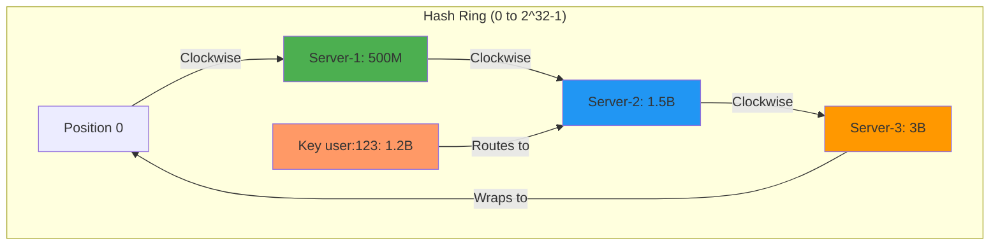
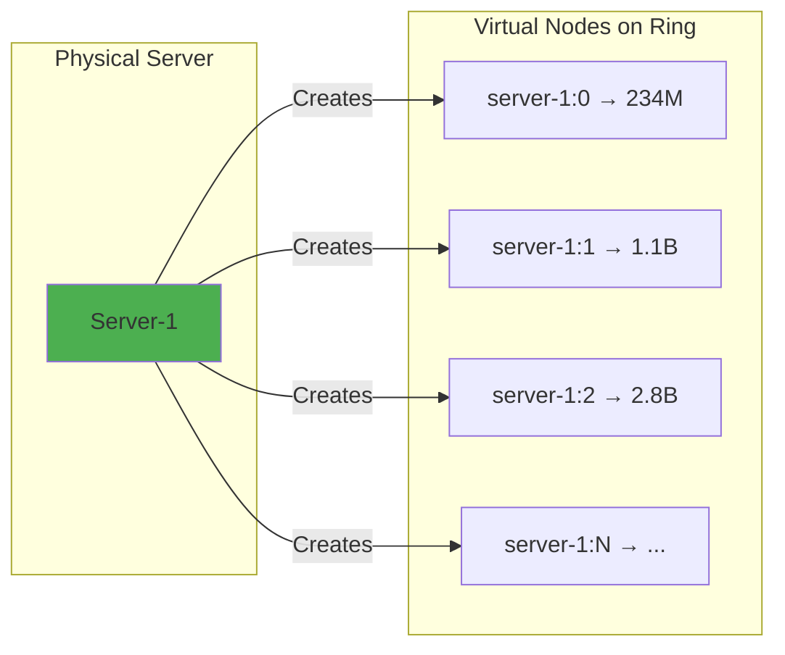
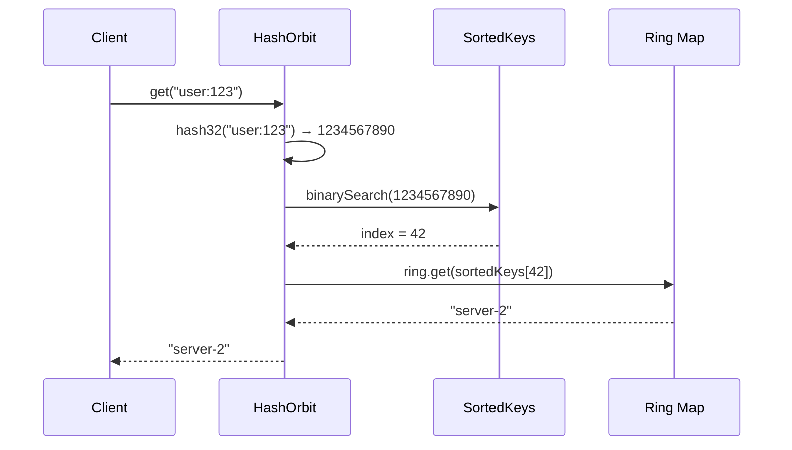

# Consistent Hashing in Distributed Systems: Building hash-orbit

**Author:** hash-orbit maintainers
**Date:** November 2025
**Reading Time:** 12 minutes

## The Problem

In distributed systems, routing requests to the correct server is fundamental. The naive approach—modulo hashing—fails catastrophically when servers change. Consider a cache layer with three servers:

```typescript
// Naive approach: hash(key) % server_count
function getServer(key: string, servers: string[]): string {
  const hash = hashFunction(key);
  return servers[hash % servers.length];
}
```

**The catastrophe:** Remove one server, and ~67% of keys remap to different servers. Add a server, and ~75% of keys move. For a cache, this means most cached data becomes unreachable, causing a thundering herd to your database.

## The Solution: Consistent Hashing

Consistent hashing minimizes disruption when the cluster changes. Remove a server: only ~1/N keys remap. Add a server: same. This property is critical for:

- **Cache layers**: Redis, Memcached sharding
- **Distributed databases**: Cassandra, DynamoDB partitioning
- **Load balancers**: Session-sticky routing
- **CDNs**: Content distribution

We built `hash-orbit` as a pure TypeScript implementation with no infrastructure opinions—just the algorithm.

## Architecture

### Core Concept: The Ring

Consistent hashing places both servers and keys on a circular hash space (0 to 2³²-1 for 32-bit hashes). To route a key:

1. Hash the key to get a position on the ring
2. Walk clockwise to find the first server
3. That server owns the key



### Virtual Nodes (Replicas)

A single position per server creates uneven distribution. **Virtual nodes** solve this: each physical server gets multiple positions on the ring.



With 150 virtual nodes per server (default), distribution becomes statistically even. The tradeoff: more memory, better balance.

### Binary Search Optimization

Naive clockwise walking is O(n). We maintain a sorted array of ring positions and use binary search for O(log n) lookup:



**Complexity:**

- Add/Remove: O(r × log(r×n)) where r = replicas, n = servers
- Get: O(log(r×n))
- GetN: O(r×n) worst case, typically O(r×k) where k = count

## Implementation Walkthrough

### 1. Core Structure

```typescript
export class HashOrbit {
  private readonly ring: Map<number, string>; // position → server
  private sortedKeys: number[]; // sorted positions
  private readonly replicas: number; // virtual nodes per server

  constructor(options: { replicas?: number } = {}) {
    this.replicas = options.replicas ?? 150;
    this.ring = new Map();
    this.sortedKeys = [];
  }
}
```

**Design choice:** `Map` for O(1) position lookup, separate sorted array for binary search. We trade memory (storing keys twice) for speed.

### 2. Adding Servers

```typescript
add(node: string): void {
  this.validateIdentifier(node, 'Node identifier');

  // Create virtual nodes
  for (let i = 0; i < this.replicas; i++) {
    const key = `${node}:${i}`;           // Deterministic virtual node ID
    const position = hash32(key);          // MurmurHash3 32-bit
    this.ring.set(position, node);
  }

  // Rebuild sorted keys for binary search
  this.sortedKeys = [...this.ring.keys()].sort((a, b) => a - b);
}
```

**Why MurmurHash3?**

- Fast: ~2 cycles per byte
- Good distribution: passes SMHasher test suite
- 32-bit output: reasonable ring size (2³²-1 positions)
- Collision rate: negligible for realistic node counts

### 3. Routing Keys

```typescript
get(key: string): string | undefined {
  this.validateIdentifier(key, 'Key');
  if (this.ring.size === 0) return undefined;

  const position = hash32(key);
  let idx = this.binarySearch(position);  // Find first position >= key hash

  // Wrap around if we're past the last server
  if (idx >= this.sortedKeys.length) idx = 0;

  return this.ring.get(this.sortedKeys[idx]!);
}
```

**Edge cases handled:**

- Empty ring: return `undefined`
- Key hash exceeds all positions: wrap to position 0 (ring property)
- Identical hashes: deterministic (same key always routes to same server)

### 4. Replication Support

```typescript
getN(key: string, count: number): string[] {
  this.validateIdentifier(key, 'Key');
  if (this.ring.size === 0 || count <= 0) return [];

  const result: string[] = [];
  const seen = new Set<string>();
  const position = hash32(key);
  let idx = this.binarySearch(position);

  // Walk clockwise, collecting unique physical servers
  for (let i = 0; i < this.sortedKeys.length && result.length < count; i++) {
    if (idx >= this.sortedKeys.length) idx = 0;

    const node = this.ring.get(this.sortedKeys[idx]!);
    if (node && !seen.has(node)) {  // Skip duplicate virtual nodes
      seen.add(node);
      result.push(node);
    }
    idx++;
  }

  return result;
}
```

**Use case:** Write to 3 replicas for fault tolerance. `getN("data:key", 3)` returns three different physical servers in clockwise order.

## Real-World Application Patterns

### Pattern 1: Redis Sharding

```typescript
import { HashOrbit } from 'hash-orbit';
import Redis from 'ioredis';

const ring = new HashOrbit({ replicas: 150 });
const clients = new Map<string, Redis>();

// Setup
['redis-1:6379', 'redis-2:6379', 'redis-3:6379'].forEach((addr) => {
  ring.add(addr);
  clients.set(addr, new Redis(addr));
});

// Usage
async function get(key: string): Promise<string | null> {
  const server = ring.get(key);
  if (!server) throw new Error('No servers available');
  return clients.get(server)!.get(key);
}

async function set(key: string, value: string): Promise<void> {
  const server = ring.get(key);
  if (!server) throw new Error('No servers available');
  await clients.get(server)!.set(key, value);
}
```

**Result:** Each Redis instance handles ~33% of keys. Add a fourth instance: only ~25% of keys remap.

### Pattern 2: Database Partitioning

```typescript
class ShardedDB {
  private ring: HashOrbit;
  private connections: Map<string, DatabaseConnection>;

  constructor(shards: string[]) {
    this.ring = new HashOrbit();
    this.connections = new Map();

    shards.forEach((shard) => {
      this.ring.add(shard);
      this.connections.set(shard, createConnection(shard));
    });
  }

  async query(userId: string, sql: string): Promise<Row[]> {
    // User data always goes to same shard
    const shard = this.ring.get(userId);
    return this.connections.get(shard!)!.query(sql);
  }

  async queryAll(sql: string): Promise<Row[]> {
    // Scatter-gather for cross-shard queries
    const results = await Promise.all(
      Array.from(this.connections.values()).map((conn) => conn.query(sql))
    );
    return results.flat();
  }
}
```

**Tradeoff:** Single-user queries are fast (one shard). Cross-user queries are slower (all shards). Design your schema accordingly.

### Pattern 3: Replicated Cache with Failover

```typescript
class ReplicatedCache {
  private ring: HashOrbit;
  private nodes: Map<string, CacheNode>;
  private replicationFactor: number;

  constructor(replicationFactor: number = 2) {
    this.ring = new HashOrbit({ replicas: 150 });
    this.nodes = new Map();
    this.replicationFactor = replicationFactor;
  }

  async get(key: string): Promise<string | null> {
    const replicas = this.ring.getN(key, this.replicationFactor);

    // Try primary, then backups
    for (const nodeId of replicas) {
      try {
        return await this.nodes.get(nodeId)!.get(key);
      } catch (err) {
        // Node failed, try next replica
        continue;
      }
    }

    return null; // All replicas failed
  }

  async set(key: string, value: string): Promise<void> {
    const replicas = this.ring.getN(key, this.replicationFactor);

    // Write to all replicas in parallel
    await Promise.allSettled(replicas.map((nodeId) => this.nodes.get(nodeId)!.set(key, value)));
  }
}
```

**Availability:** With replication factor 2, losing one server doesn't lose data. Reads automatically fail over.

### Pattern 4: State Persistence

```typescript
// Save cluster state
const state = ring.toJSON();
await fs.writeFile('/etc/app/ring-state.json', JSON.stringify(state));

// Restore on startup
const saved = JSON.parse(await fs.readFile('/etc/app/ring-state.json'));
const ring = HashOrbit.fromJSON(saved);

// Ring is identical: same nodes, same positions, same routing
```

**Use case:** Graceful restarts without reconfiguration. Workers can share ring state via Redis or distributed config.

## Key Design Decisions

### Why TypeScript?

**Type safety at API boundaries.** Consistent hashing is infrastructure—the last place you want runtime surprises. TypeScript catches errors at compile time:

```typescript
ring.get(123); // Error: Argument must be string
ring.getN('key', '2'); // Error: Count must be number
```

### Why No Built-In Networking?

**Separation of concerns.** We provide the algorithm; you provide the nodes. This enables:

- Use with any protocol (Redis, HTTP, gRPC, custom)
- No forced connection pooling strategy
- No dependencies on networking libraries
- Works in browsers, Node.js, Deno, Bun

### Why MurmurHash Over SHA-256?

| Hash Function | Speed   | Distribution | Output Size | Cryptographic |
| ------------- | ------- | ------------ | ----------- | ------------- |
| MurmurHash3   | 2GB/s   | Excellent    | 32-bit      | No            |
| SHA-256       | 150MB/s | Excellent    | 256-bit     | Yes           |

**Tradeoff:** We don't need cryptographic properties (no adversaries), but we need speed. MurmurHash3 is 13× faster and sufficient for partitioning.

### Why 150 Virtual Nodes Default?

Tested distribution with varying replica counts:

| Replicas | Std Dev (load distribution) | Memory per server | Add/Remove time |
| -------- | --------------------------- | ----------------- | --------------- |
| 10       | 12.3%                       | 640 bytes         | ~1ms            |
| 50       | 5.1%                        | 3.2 KB            | ~4ms            |
| 150      | 2.8%                        | 9.6 KB            | ~9ms            |
| 500      | 1.2%                        | 32 KB             | ~30ms           |

**150 is the sweet spot:** <3% load variance, <10ms operation time, minimal memory. Increase for better balance; decrease for speed.

## Performance Characteristics

Real-world benchmarks on Apple M1 Pro:

```
Setup: 3 servers, 150 replicas each (450 virtual nodes)

add():      ~9ms    (150 positions, 1 sort)
remove():   ~7ms    (150 deletions, 1 sort)
get():      ~400ns  (9 binary search comparisons)
getN(5):    ~2μs    (5 unique nodes from 450 positions)

Memory: ~30KB for 450 positions (64 bytes per Map entry)
```

**Scaling:**

- 10 servers (1500 positions): get() ~500ns
- 100 servers (15000 positions): get() ~650ns
- 1000 servers (150000 positions): get() ~800ns

Logarithmic growth means the algorithm scales to large clusters.

## When to Use hash-orbit

### ✅ Good Fit

- **Stateful sharding**: Route entities to specific servers (user → shard)
- **Cache layers**: Distribute keys across Redis/Memcached instances
- **Sticky sessions**: Route users to same application server
- **Static clusters**: Servers known at startup, infrequent changes

### ❌ Poor Fit

- **Stateless load balancing**: Use round-robin or least-connections instead
- **Dynamic service discovery**: Frequent cluster changes make consistent hashing overhead unnecessary
- **Single server**: Obvious, but worth stating
- **High-throughput systems with microsecond budgets**: The ~400ns lookup might matter; profile first

## Alternatives and Tradeoffs

| Approach           | Redistribution on Change | Lookup Speed | Memory   | Complexity |
| ------------------ | ------------------------ | ------------ | -------- | ---------- |
| Modulo hashing     | ~67-75%                  | O(1)         | Minimal  | Trivial    |
| Consistent hashing | ~1/N                     | O(log n)     | Moderate | Medium     |
| Rendezvous hashing | ~1/N                     | O(n)         | Minimal  | Low        |
| Jump hash          | ~1/N                     | O(log n)     | Minimal  | Low        |

**Jump hash** is faster with no memory overhead but requires contiguous server IDs (0, 1, 2...). Consistent hashing works with arbitrary identifiers (`"redis-prod-1"`, `"10.0.1.42:6379"`).

**Rendezvous hashing** has simpler code but O(n) lookup (hash every server for each key). Fine for small clusters (<100 servers).

## Conclusion

Consistent hashing solves a specific problem well: minimizing key redistribution in distributed systems. `hash-orbit` implements the algorithm as a pure, composable building block—no opinions, no surprises.

The tradeoffs are clear:

- **Cost:** ~400ns per lookup, ~30KB memory per 450 virtual nodes
- **Benefit:** ~1/N keys move when cluster changes, predictable routing

If you're building cache sharding, database partitioning, or sticky load balancing, consistent hashing likely fits. If you're just distributing load and don't care which server handles which request, simpler approaches suffice.

**Read the code:** [github.com/vnykmshr/hash-orbit](https://github.com/vnykmshr/hash-orbit)
**Install:** `npm install hash-orbit`

---

**Further Reading:**

1. Karger et al., "Consistent Hashing and Random Trees" (1997) — Original paper
2. "Dynamo: Amazon's Highly Available Key-value Store" (2007) — Production use at scale
3. Lamping & Veach, "A Fast, Minimal Memory, Consistent Hash Algorithm" (2014) — Jump hash comparison

**Questions?** Open an issue or discussion on GitHub.
